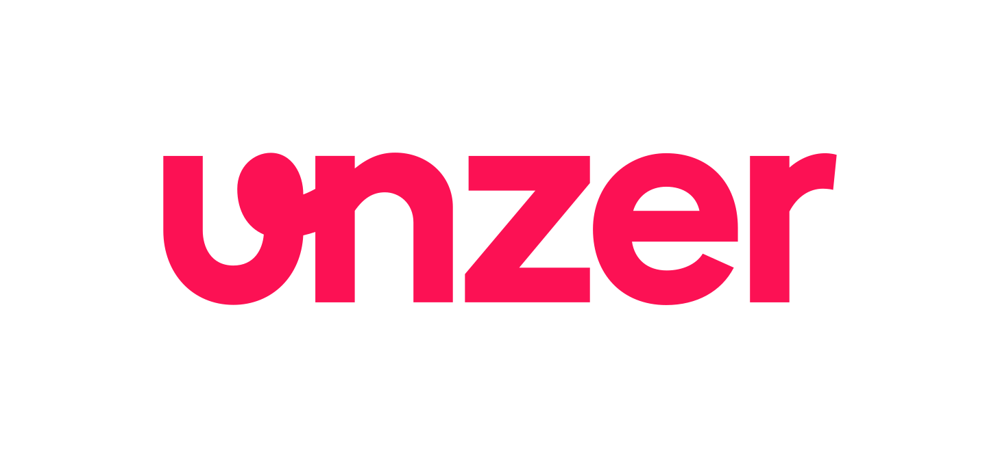

# Unzer php-sdk
This SDK provides for an easy way to connect to the Unzer Rest API.

Please refer to the following documentation for installation instructions and usage information.

*   [API Documentation](https://docs.unzer.com)
*   [PHP SDK Documentation](https://docs.unzer.com/server-side-integration/php-sdk-integration)
*   [How to use the examples](https://docs.unzer.com/server-side-integration/php-sdk-integration/php-example-implementation)
*   [Debugging](https://docs.unzer.com/server-side-integration/php-sdk-integration/php-error-handling/#debug-log)
*   [Supported payment types](https://docs.unzer.com/online-payments/supported-payment-methods)

## Supported features
*   Webhooks and event handling
*   Payment Page (embedded and hosted)
*   Payout (Credit)
*   Recurring Payment

## Support
For any issues or questions please get in touch with our support team.

### Web page
[https://docs.unzer.com/](https://docs.unzer.com/)

### Email
[support@unzer.com](mailto:support@unzer.com)

### Phone
* DE: [+49 6221 43101-00](tel:+4962214310100)
* AT: [+43 1 513 66 33 669](tel:+4315136633669)

### Twitter
[@UnzerTech](https://twitter.com/UnzerTech)
